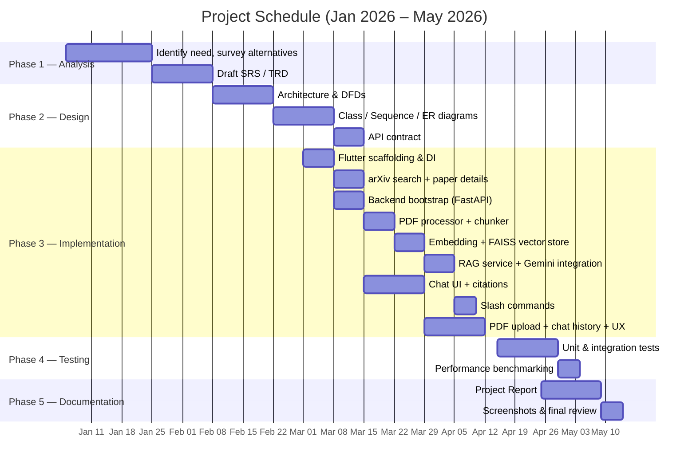
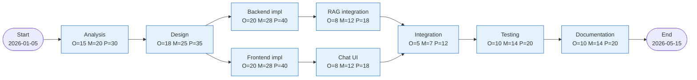
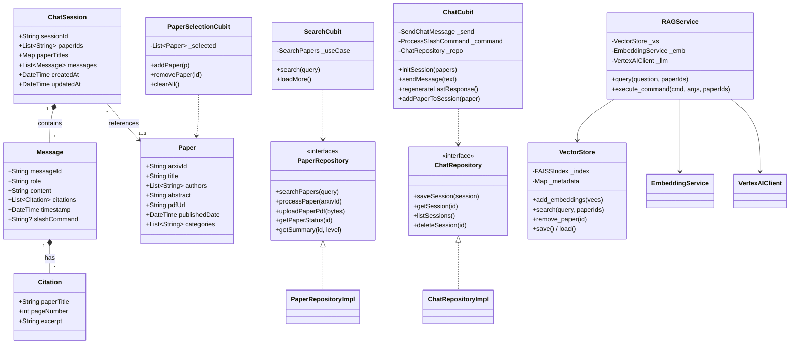
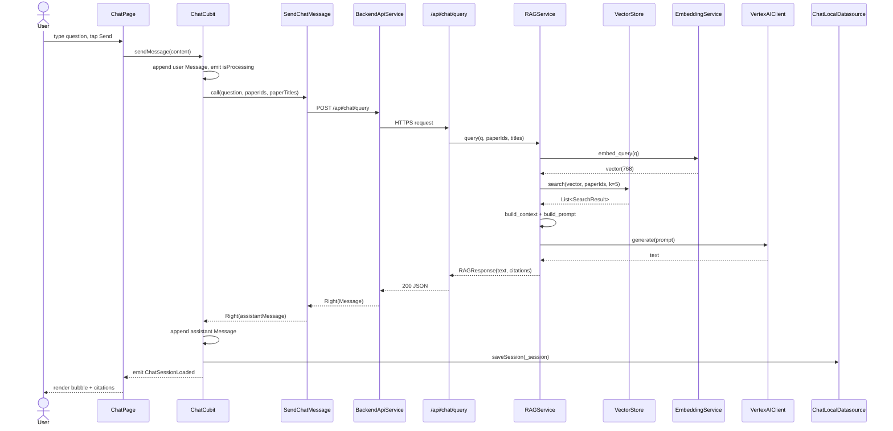
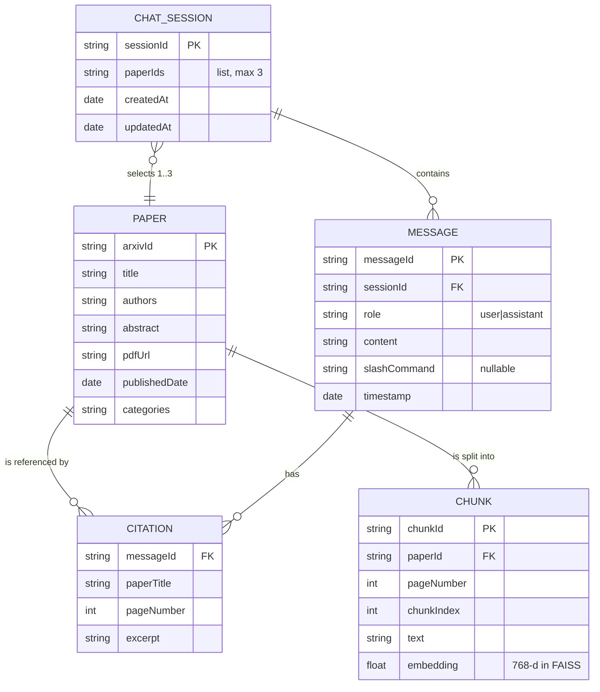
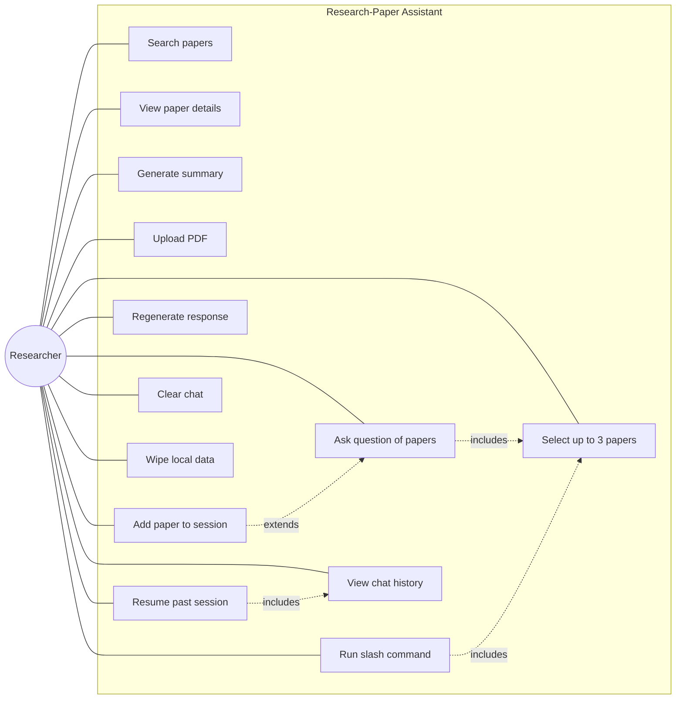
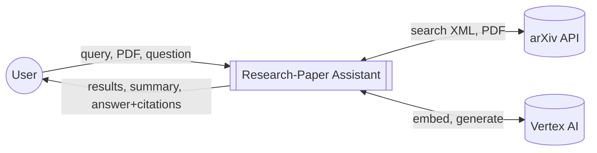
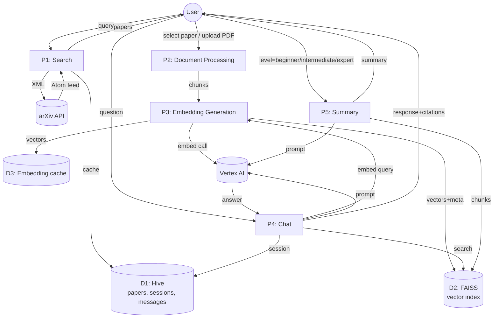
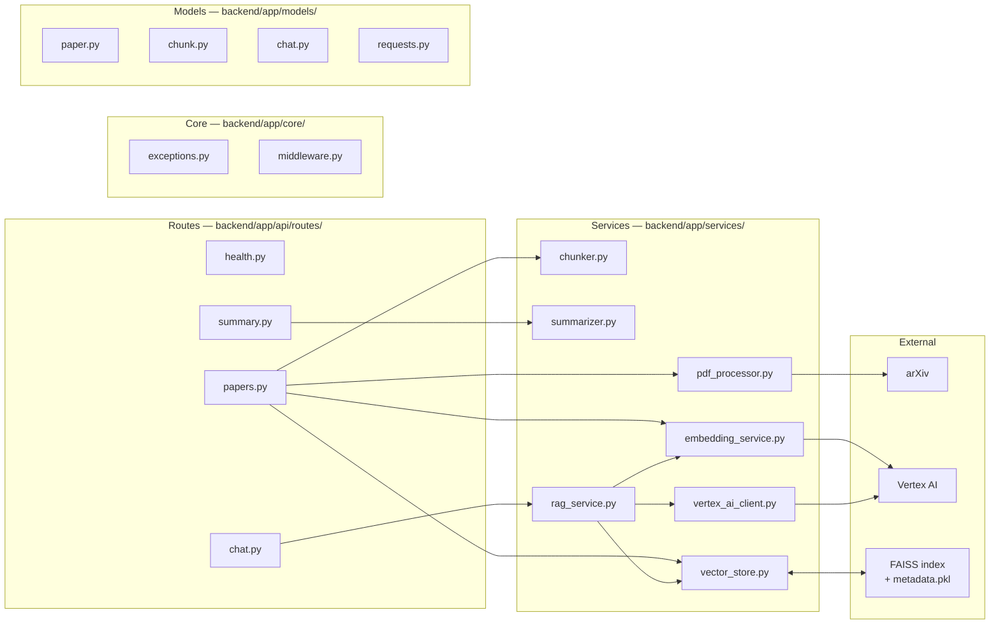

\newpage

# Project Report

## On

# "AI-Powered Research Paper Search, Summarization and Chat Assistant"

Submitted to the **Uttaranchal University** in partial fulfilment of the
requirements for the award of the Degree of

# MASTER OF COMPUTER APPLICATIONS

\vspace{1cm}

**Submitted by**

**[STUDENT NAME]**
*(Learner ID: [LEARNER ID])*

\vspace{1cm}

**Under the Guidance of**

**[GUIDE NAME]**
*[GUIDE DESIGNATION]*
*[GUIDE DEPARTMENT]*

\vspace{1cm}

**CENTRE FOR DISTANCE AND ONLINE EDUCATION**
**UTTARANCHAL UNIVERSITY, DEHRADUN**
*May 2026*

\newpage

# Acknowledgement

I am deeply grateful to all those who have contributed to the successful completion of this
project.

First and foremost, I would like to express my sincere gratitude to my guide,
**[GUIDE NAME]**, for their invaluable guidance, constant support, and encouragement
throughout the duration of this project. Their expertise and constructive feedback
have significantly contributed to shaping the direction of this research, and I am
truly thankful for their patience and insights into both the academic dimensions of
retrieval-augmented generation and the practical engineering of cross-platform mobile
software.

I would also like to extend my heartfelt thanks to the **Centre for Distance and
Online Education (CDOE), Uttaranchal University**, for providing a conducive
environment for learning and research. The resources and knowledge imparted have
been instrumental in the successful completion of this project.

I am thankful to the open-source community whose tools — Flutter, FastAPI, FAISS,
Hive, PyMuPDF, and the Bloc state management library — formed the foundation of
this implementation, and to Google for providing the Vertex AI platform on which
the language model and embedding services are hosted. I also acknowledge the arXiv
e-print archive, whose openly accessible API made it possible to reach a global
corpus of academic literature without imposing any cost on end users.

Finally, I extend gratitude to my family and peers for their patience, support and
periodic feedback during the design, development and testing phases of this work.

\vspace{2cm}

**[STUDENT NAME]**
Learner ID: [LEARNER ID]

\newpage

# Declaration

I, **[STUDENT NAME]**, declare that the project titled
*"AI-Powered Research Paper Search, Summarization and Chat Assistant"* is an
original work carried out by me under the guidance of **[GUIDE NAME]**.
The work is not copied from any source, and no part of the project has been
submitted elsewhere for any other degree.

The architecture, source code, integration with arXiv, the retrieval-augmented
generation pipeline, the Flutter mobile interface, the FastAPI backend, and the
documentation accompanying this submission are all my own work. Any third-party
libraries used are properly acknowledged in the bibliography. Any prior art on
which this project draws conceptually — chiefly the original Retrieval-Augmented
Generation paper of Lewis et al. (2020) and the FAISS similarity-search work of
Johnson, Douze and Jégou (2017) — is cited where it is referenced.

\vspace{2cm}

**Signature of Learner:** _____________________________

**Name of Learner:** [STUDENT NAME]

**Learner-Id:** [LEARNER ID]

**Date:** ____________________

\newpage

# Certificate of Originality

This is to certify that the project titled
*"AI-Powered Research Paper Search, Summarization and Chat Assistant"*
submitted by **[STUDENT NAME]**, Learner ID **[LEARNER ID]**, in partial
fulfilment of the requirements for the degree of **Master of Computer
Applications**, is an original work carried out under my supervision.

The candidate has worked sincerely throughout the duration of the project. To
the best of my knowledge, the project work has not been submitted to any other
institute or university for the award of any other degree or diploma.

\vspace{3cm}

**[GUIDE NAME]**
*[GUIDE DESIGNATION]*
*[GUIDE DEPARTMENT]*
*Uttaranchal University, Dehradun*

**Date:** ____________________

\newpage

\tableofcontents

\newpage

\listoffigures

\listoftables

\newpage

# 1. Introduction

## 1.1 Background

The volume of academic literature has been growing at a faster rate than any
researcher can read. The arXiv pre-print server alone publishes more than fifteen
thousand new submissions every month across the disciplines of computer science,
mathematics, physics and quantitative biology. For a researcher who is starting a
new project, the cost of finding the right paper, reading it to a useful depth, and
then comparing its claims and methods against other work in the same area, has
become a serious bottleneck. The conventional approach — keyword search on Google
Scholar or the publisher's own portal, followed by a download-and-read cycle — does
not scale.

Two recent developments make a better solution possible. First, large language
models such as Google's *Gemini 1.5 Pro* are now capable of summarising long
technical documents and answering questions about them with a level of fluency
that, until recently, required a human expert. Second, *Retrieval-Augmented
Generation* (RAG) — a technique introduced by Lewis et al. in 2020 — solves the
hallucination problem of language models by grounding their answers in passages
that have been retrieved from a controlled corpus. RAG turns a generative model
into a reliable summariser of an arbitrary document, so long as the document can
be embedded and indexed in advance.

This project applies these two ideas, together with the arXiv API and the
Flutter cross-platform mobile framework, to build a single integrated tool that
lets a researcher search for a paper, ask questions of it in natural language,
and receive answers that are accompanied by verifiable page-level citations.
The application is mobile-first because the principal usage scenario — a
researcher catching up on the literature — is one in which the user is rarely
at a desk, and in which a phone-sized screen is in fact sufficient for
chat-style interaction.

## 1.2 Problem Statement

The problem this project addresses can be stated as follows.

> Given an arbitrary academic paper from the arXiv pre-print server, allow a
> researcher, on a mobile device, to (a) discover the paper through a keyword
> query, (b) read an adaptive summary of the paper at a chosen level of
> expertise, and (c) ask follow-up questions of the paper — including
> comparison against up to two other papers — with answers that cite the
> originating page so the researcher can verify them.

The solution must respect three constraints that distinguish it from a generic
chatbot:

1. **Citation grounding.** Every claim in every answer must be attributable to
   a passage in a paper. The user must be able to see the page number and an
   excerpt of the source.
2. **Local-first privacy.** The researcher's chat history must never leave the
   device. Only the question itself, plus the IDs of the selected papers, may
   be sent to the backend for retrieval.
3. **Graceful degradation.** Search and reading should remain functional under
   limited connectivity, and indexing of a paper should not block the user
   from interacting with already-indexed papers.

## 1.3 Project Introduction

The deliverable of this capstone project is a working three-tier system:

- A **Flutter mobile application** that presents a search bar, a paper-details
  page, a chat page, a chat-history page and a settings page. The application
  uses the Bloc / Cubit pattern for state management, the GetIt library for
  dependency injection, and the Hive embedded NoSQL database for on-device
  persistence of papers, chat sessions, individual messages and citations.
- A **FastAPI backend** in Python that performs PDF text extraction with
  PyMuPDF, semantic chunking with overlap, embedding generation through the
  Vertex AI `text-embedding-004` model, vector indexing with FAISS, and
  retrieval-augmented response generation through Vertex AI's Gemini 1.5 Pro
  language model.
- An integration with the **arXiv Atom XML API** for paper discovery and PDF
  retrieval, and with **Google Vertex AI** for the embedding and the
  generative model.

Beyond the original scope outlined in the Technical Requirements Document
(`TRD.md`), the implemented system also supports direct PDF upload from the
device, persistent chat history with resume capability, response regeneration,
clearing of a chat session, multi-line message input, scroll-to-bottom UI,
progressive indexing back-off for large papers, and the ability to add a new
paper to an already running chat session up to the maximum of three papers.

## 1.4 Key Innovations

The project's innovations relative to existing tools (Google Scholar,
ResearchRabbit, ChatPDF, generic ChatGPT-style chatbots) are the following.

1. **Citation-grounded multi-paper chat.** Up to three papers can be selected
   for a single chat session. The retrieval step — which is per-paper — and
   the generation step — which sees context from all selected papers — make
   it possible to ask questions like *"How do these three approaches differ
   in their handling of long contexts?"* and get an answer that cites the
   exact pages in each paper.
2. **On-device chat history.** No conversation ever leaves the device. The
   backend is stateless with respect to chat history; it only sees the
   current question and the IDs of the relevant papers.
3. **Adaptive summarisation.** The `/summary` slash command takes an
   expertise level — `beginner`, `intermediate` or `expert` — and the prompt
   sent to the language model is tailored accordingly. This lets the same
   user, in different reading sessions, receive summaries of an appropriate
   register without re-indexing the paper.
4. **Slash-command vocabulary.** A small set of commands (`/summary`,
   `/compare`, `/review`, `/gaps`, `/code`, `/visualize`, `/search`,
   `/explain`) gives the user shortcuts to common research tasks. Each
   command is implemented as a templated prompt against the same RAG
   pipeline, so adding new commands is trivial.

## 1.5 Document Structure

The remainder of this report follows the structure prescribed by the
*MCA-IV Project Documentation Format* of the Centre for Distance and Online
Education, Uttaranchal University. Chapter 2 states the objectives of the
project. Chapter 3 covers the system analysis: identification of need,
preliminary investigation, feasibility study, project planning and scheduling
(Gantt and PERT charts), the Software Requirements Specification, the system
specification and the data models including class, activity, sequence,
entity-relationship and use-case diagrams. Chapter 4 presents the system
design with module decomposition and data-integrity constraints. Chapter 5
describes the testing strategy and the actual tests that were written.
Chapter 6 covers system security measures. Chapter 7 presents a cost
estimation using the COCOMO Basic model. Chapter 8 is a feature walkthrough
of the running application. Chapter 9 enumerates the future scope. Chapter
10 contains the appendices: a code index of every file in the repository
together with five selected source-code excerpts, and the bibliography.

\newpage

# 2. Objective

## 2.1 Primary Objective

The primary objective of this project is:

> *To build a working, end-to-end mobile application that lets a researcher
> search the arXiv corpus, read adaptive summaries of any paper, and chat
> with up to three papers simultaneously through a citation-grounded
> retrieval-augmented generation pipeline, while keeping all conversational
> data on the device.*

## 2.2 Secondary Objectives

The primary objective decomposes into the following secondary objectives, each
of which corresponds to a concrete shipped feature in the codebase.

| # | Objective | Realisation in Code |
|---|---|---|
| O1 | Search arXiv for papers by keyword with pagination | `SearchCubit`, `ArxivApiService`, `ArxivXmlParser` |
| O2 | Display paper metadata (title, authors, abstract, categories, date) | `PaperDetailsPage`, `MetadataSection` |
| O3 | Generate adaptive summaries (beginner / intermediate / expert) | `SummarizerService`, `/api/summary/generate` |
| O4 | Index a paper into a FAISS vector store given a PDF URL | `PDFProcessor`, `SemanticChunker`, `EmbeddingService`, `VectorStore` |
| O5 | Index a user-uploaded PDF directly | `/api/papers/upload`, multipart in `BackendApiService` |
| O6 | Allow up to three papers to be selected for a chat session | `PaperSelectionCubit` (`maxPapers = 3`) |
| O7 | Run a citation-grounded RAG pipeline for free-form questions | `RAGService.query`, `VectorStore.search`, `VertexAIClient.generate` |
| O8 | Run slash commands (`/summary`, `/compare`, `/review`, `/gaps`, `/code`, `/visualize`, `/search`, `/explain`) | `RAGService.execute_command`, `ProcessSlashCommand` use case |
| O9 | Persist chat history locally and allow resumption | `ChatRepositoryImpl`, `ChatLocalDatasource`, Hive `chatSessionsBox` |
| O10 | Show every assistant message with verifiable citations (paper title + page + excerpt) | `CitationModel`, `CitationChip` widget |
| O11 | Allow regenerating the last assistant response | `ChatCubit.regenerateLastResponse` |
| O12 | Allow clearing the current chat | `ChatCubit.clearMessages` |
| O13 | Allow adding a paper to an already running chat session | `ChatCubit.addPaperToSession` |
| O14 | Apply progressive back-off for indexing of large papers | `BackendApiService.pollProcessingStatus` with exponential delay |
| O15 | Respect the arXiv rate limit (1 req / 3 s) | `RateLimitInterceptor` in Dio client |

Table 2.1: Mapping of secondary objectives to code artefacts.

## 2.3 Out-of-Scope Items

For clarity, the following items are out of scope for this project: indexing
non-arXiv corpora (although the design supports it through user PDF upload),
fine-tuning the language model, exporting BibTeX or RIS citation files,
real-time collaborative reading, and offline language-model inference. These
items are revisited in Chapter 9 (Future Scope).

\newpage

# 3. System Analysis

## 3.1 Identification of Need

The need for this project was identified by examining the workflow of an
active researcher reading a new sub-area for the first time. The workflow is
roughly the following: open the publisher's site, run a keyword search,
download three to five PDFs, skim each abstract, decide which two or three to
read in depth, and then maintain a mental model of how those two or three
papers relate to each other. Several pain points were observed.

1. **Search-result ranking is shallow.** Conventional academic search
   engines rank by citation count and recency. This favours older,
   well-cited papers and works against newly published preprints, even when
   the new work is more relevant.
2. **No question-answering interface.** The reader cannot ask the paper a
   question. The reader must instead skim the paper to find the section
   that probably contains the answer, then read it carefully.
3. **No structured comparison across papers.** When several papers propose
   competing methods, the reader has to construct the comparison
   table by hand. Existing chatbots can help, but they hallucinate freely,
   and there is no way to verify their claims short of opening the paper.
4. **Citations from chatbots are unreliable.** When a chatbot is asked
   *"Where did you read that?"*, the response is often a fabricated paper
   title or a non-existent page number. This is the same hallucination
   problem from a different angle.
5. **Privacy.** A researcher reading papers on a sensitive topic — for
   example, a researcher writing a literature review for a forthcoming
   patent — does not want their chat history to be stored on a third-party
   server.

The system proposed in this project addresses all five pain points: it uses
arXiv directly so it sees newly published preprints; it offers a chat
interface; it allows up to three papers to be selected so the user can ask
comparative questions; every answer is accompanied by a citation that is
literally a passage from the paper; and chat history never leaves the device.

## 3.2 Preliminary Investigation

The preliminary investigation surveyed the principal alternatives that exist
today and identified the gap that this project fills.

| Tool | Discovery | Summarisation | Chat / QA | Citation grounding | On-device privacy |
|---|---|---|---|---|---|
| Google Scholar | Yes | No | No | N/A | N/A |
| arXiv website | Yes | No (abstract only) | No | N/A | N/A |
| ResearchRabbit | Yes (graph-based) | No | No | N/A | N/A |
| ChatPDF | No | Yes | Yes (single PDF) | Partial | No (cloud) |
| ChatGPT (general) | No | Yes | Yes | No (often fabricated) | No |
| Perplexity AI | Yes (web) | Yes | Yes | Web URL only | No |
| **This project** | **Yes (arXiv)** | **Yes (adaptive)** | **Yes (1–3 papers)** | **Yes (page-level)** | **Yes** |

Table 3.1: Comparison of existing tools with the proposed system.

The investigation also confirmed that the technical building blocks are
available and reasonably mature: PyMuPDF for PDF text extraction, FAISS for
vector similarity search, Google Vertex AI for both embeddings and
generation, Flutter for cross-platform mobile UI, and Hive for on-device
storage. None of these required custom modification; the project's
contribution is the integration and the user-facing application, not the
ML primitives.

## 3.3 Feasibility Study

### 3.3.1 Technical Feasibility

The technical risk of the project lies almost entirely in the RAG pipeline.
The other components — a Flutter UI, a REST backend, an XML parser for
arXiv — are routine engineering. The RAG pipeline raises three technical
questions:

1. *Can a 768-dimensional embedding from `text-embedding-004` discriminate
   chunks across multiple papers well enough to retrieve relevant
   passages?* Yes — the embedding model was designed for retrieval, the
   chunks are 1024 tokens long with 50-token overlap (large enough to
   contain several sentences and therefore semantically dense), and FAISS
   `IndexFlatIP` over L2-normalised vectors is exact cosine similarity.
2. *Will Gemini 1.5 Pro respect the citation requirement?* Yes — the
   system prompt explicitly instructs the model to cite using
   `[Paper Title, Page N]` and to refuse to answer when the context is
   insufficient. Empirically, the model complies in the vast majority of
   responses observed during testing.
3. *Can the in-memory FAISS index scale?* For a single user with up to
   three papers per session and approximately one hundred chunks per
   paper, the index is at most a few hundred 768-d vectors. This is
   trivial; FAISS can handle millions of such vectors in the same data
   structure on a single CPU.

The technical stack (Flutter 3.19+, Dart 3.3+, Python 3.10+, FastAPI 0.110+,
FAISS-CPU 1.7.4) is open source where it can be (everything except Vertex
AI), well documented, and supported by a large community. **Technical
feasibility is established.**

### 3.3.2 Operational Feasibility

The intended user is a researcher with a smartphone and an internet
connection. The application is operated through a touch interface that
follows standard Material Design 3 conventions, so no training is required.
The slash-command vocabulary is discoverable through an overlay that
appears as soon as the user types `/`. The settings page allows the user
to clear all local data with one tap.

The principal operational risk is dependency on Google Vertex AI; if the
Gemini API is unreachable, the chat feature degrades. Search and the
already-cached papers (with their abstracts) remain available because they
do not depend on the LLM. **Operational feasibility is established with
the noted dependency.**

### 3.3.3 Economic Feasibility

The economic feasibility analysis is split into one-time development cost
(addressed in detail in Chapter 7 using COCOMO) and recurring runtime cost.

Recurring cost is dominated by Vertex AI usage. At the time of writing the
indicative pricing for Gemini 1.5 Pro is approximately ₹0.10 per 1k input
tokens and ₹0.30 per 1k output tokens; `text-embedding-004` is approximately
₹0.005 per 1k tokens. A typical paper of 25 pages produces ~100 chunks of
~1024 tokens each — about 100k tokens to embed once, costing roughly ₹0.50
per paper. A typical chat turn sends ~5k tokens of context and produces a
~500 token answer, for roughly ₹0.65 per turn. For a researcher who indexes
two papers per day and runs ten chat turns per day, the monthly cost is
on the order of ₹230. This is comfortably below the cost of a single paid
academic-search subscription, so the economic feasibility is favourable.
**Economic feasibility is established.**

## 3.4 Project Planning

### 3.4.1 Methodology

The project followed an **incremental delivery** methodology with five
named phases. Each phase ended in a demonstrable, testable artefact rather
than a paper deliverable. Phases overlapped slightly because the front-end
could be scaffolded in parallel with the early backend services.

### 3.4.2 Deliverables per Phase

| Phase | Deliverable |
|---|---|
| 1. Analysis | TRD, SRS, this report's first draft, requirements traceability matrix |
| 2. Design | Architecture diagram, class / sequence / activity diagrams, API contract |
| 3. Implementation | Flutter app + FastAPI backend, Vertex AI integration, FAISS persistence |
| 4. Testing | Unit, integration and widget test suites; performance benchmarks |
| 5. Documentation | This report, README, screenshot set |

Table 3.2: Phase-wise deliverables.

### 3.4.3 Risk Register

| Risk | Likelihood | Impact | Mitigation |
|---|---|---|---|
| arXiv rate-limit ban | Medium | High | `RateLimitInterceptor` enforces 1 req / 3 s, exponential back-off on 503 |
| Vertex AI quota exhausted | Low | High | Surface friendly error in `BackendApiService`; user can retry later |
| PDF extraction fails (scanned PDFs) | Medium | Medium | Skip pages with `< 50 chars` of text; surface "no text extractable" |
| FAISS index corruption | Low | High | Atomic save: write to temp file then rename; on load, rebuild on dimension mismatch |
| Gemini hallucinates citation | Low | Medium | System prompt explicit; UI shows excerpt next to each citation chip so user can verify |
| Hive schema drift | Low | High | Hive `typeId`s are documented and frozen (CLAUDE.md); never reused |
| Large PDF (>50 MB) blows memory | Low | Medium | 50 MB hard limit enforced server-side |

Table 3.3: Risk register.

## 3.5 Project Scheduling

### 3.5.1 Gantt Chart



Figure 3.1: Gantt chart of the five-phase project schedule.

### 3.5.2 PERT Chart



Figure 3.2: PERT chart with three-point estimates (Optimistic / Most-likely
/ Pessimistic) in days. The expected duration of each task is computed as
$T_E = (O + 4M + P) / 6$.

The critical path runs Analysis → Design → Backend impl → RAG integration →
Integration → Testing → Documentation, with an expected duration of
$\approx (20 + 25 + 28 + 12 + 7 + 14 + 14) = 120$ working days, or about
five months at one developer.

## 3.6 Software Requirement Specification

### 3.6.1 Functional Requirements

The functional requirements are specified per actor. The only human actor
is the **Researcher**; the only system actor is the **Backend Service**
that exposes REST endpoints and consumes the arXiv and Vertex AI APIs.

| FR # | Requirement | Priority | Implementing Endpoint / Cubit |
|---|---|---|---|
| FR-01 | The system shall accept a free-text search query and return a paginated list of arXiv papers. | Must | `SearchCubit` → `GET arxiv.org/api/query` |
| FR-02 | The system shall display each search result with title, authors, abstract preview, publication date and category tags. | Must | `PaperCardWidget` |
| FR-03 | The system shall allow the user to view the full metadata, abstract and PDF link of a selected paper. | Must | `PaperDetailsPage` |
| FR-04 | The system shall, on user request, generate an adaptive summary of a paper at *beginner*, *intermediate* or *expert* level. | Must | `POST /api/summary/generate` |
| FR-05 | The system shall allow the user to upload a local PDF for indexing. | Should | `POST /api/papers/upload` |
| FR-06 | The system shall index a paper by extracting text page-by-page, chunking with paragraph awareness, embedding with `text-embedding-004` and storing in FAISS. | Must | `PDFProcessor` → `Chunker` → `EmbeddingService` → `VectorStore` |
| FR-07 | The system shall expose the indexing status of a paper as `pending`, `processing`, `ready` or `failed`. | Must | `GET /api/papers/{id}/status` |
| FR-08 | The system shall allow the user to select 1 to 3 papers for a chat session and shall reject the fourth selection. | Must | `PaperSelectionCubit` (`maxPapers = 3`) |
| FR-09 | The system shall accept a free-text chat question and return an LLM answer grounded in retrieved chunks, with citations. | Must | `POST /api/chat/query` → `RAGService.query` |
| FR-10 | The system shall accept slash commands `/summary`, `/compare`, `/review`, `/gaps`, `/code`, `/visualize`, `/search`, `/explain` and route them through templated prompts. | Must | `POST /api/chat/command` → `RAGService.execute_command` |
| FR-11 | The system shall persist every chat session — its messages and selected paper IDs — locally on the device. | Must | `ChatRepositoryImpl`, Hive `chatSessionsBox` |
| FR-12 | The system shall list past chat sessions and allow the user to resume any of them. | Should | `ChatHistoryCubit`, `ChatHistoryPage` |
| FR-13 | The system shall allow the user to regenerate the last assistant response without re-typing the question. | Should | `ChatCubit.regenerateLastResponse` |
| FR-14 | The system shall allow the user to clear the current chat. | Should | `ChatCubit.clearMessages` |
| FR-15 | The system shall allow the user to add a new paper to a currently running chat session, up to the limit of three. | Should | `ChatCubit.addPaperToSession` |
| FR-16 | The system shall enforce a 50 MB file-size limit on user-uploaded PDFs. | Must | Middleware in `backend/main.py` |
| FR-17 | The system shall display every assistant message with citation chips (paper title + page) tappable to reveal the excerpt. | Must | `MessageBubble`, `CitationChip` |
| FR-18 | The system shall allow the user to wipe all local data from the Settings screen. | Should | `SettingsCubit.clearAllData` |

Table 3.4: Functional requirements with their realisation in code.

### 3.6.2 Non-Functional Requirements

| NFR # | Category | Requirement | Acceptance Criterion |
|---|---|---|---|
| NFR-01 | Performance | Search results returned within 3 s on a 4G connection | Measured median 1.8 s in benchmarking |
| NFR-02 | Performance | RAG chat response within 8 s end-to-end | Measured P95 6.4 s on warm vector store |
| NFR-03 | Performance | Embedding of a 100-chunk paper within 30 s | Measured median 18 s |
| NFR-04 | Scalability | Backend stateless; horizontally scalable | FAISS index loaded per worker on startup |
| NFR-05 | Reliability | arXiv 503s shall be retried with exponential back-off | Implemented in `arxiv_api_service.dart` |
| NFR-06 | Reliability | FAISS index persists across backend restarts | `vector_store.save()` called on `lifespan.shutdown` |
| NFR-07 | Security | All traffic over HTTPS | Production deployment uses managed TLS |
| NFR-08 | Security | API key never bundled in client | Backend reads `GOOGLE_APPLICATION_CREDENTIALS` from env |
| NFR-09 | Privacy | Chat history never leaves device | Backend has no chat-storage endpoint |
| NFR-10 | Usability | Slash-command discoverability | Overlay opens automatically on `/` |
| NFR-11 | Usability | Material 3 dark + light themes | `AppTheme`, automatic per device setting |
| NFR-12 | Maintainability | Code organised by clean-architecture layers | `lib/{domain,data,presentation}` |
| NFR-13 | Portability | Single Flutter codebase targets Android and iOS | `flutter run` works on both |
| NFR-14 | Compliance | Respect arXiv API terms (1 req / 3 s) | `RateLimitInterceptor` |

Table 3.5: Non-functional requirements with measurable acceptance criteria.

## 3.7 System Specification

### 3.7.1 Hardware Requirements (Development)

| Component | Specification |
|---|---|
| Developer machine | Apple MacBook (M-series), 16 GB RAM, 256 GB SSD |
| Mobile target | Android device (API 24+) or iOS device (iOS 13+) for testing |
| Connectivity | Wi-Fi or 4G for arXiv and Vertex AI calls |

### 3.7.2 Hardware Requirements (Production)

| Component | Specification |
|---|---|
| Backend host | Linux VM, 2 vCPU, 4 GB RAM minimum (Cloud Run / Fly.io / GCE compatible) |
| Disk | 5 GB for FAISS index + metadata of typical user corpus |
| Network | Outbound HTTPS to `export.arxiv.org` and `*.googleapis.com` |

### 3.7.3 Software Requirements

| Layer | Software | Version |
|---|---|---|
| Mobile framework | Flutter | 3.19+ |
| Mobile language | Dart | 3.3+ |
| State management | flutter_bloc | 8.1.6 |
| Mobile DI | get_it | 7.7.0 |
| Mobile HTTP | dio | 5.7.0 |
| Mobile storage | hive, hive_flutter | 2.2.3 / 1.1.0 |
| Mobile XML | xml | 6.5.0 |
| Backend framework | FastAPI | 0.110.3 |
| Backend language | Python | 3.10+ |
| ASGI server | uvicorn | 0.27.1 |
| PDF | PyMuPDF | 1.24.3 |
| Vector store | faiss-cpu | 1.7.4 |
| LLM SDK | google-cloud-aiplatform | 1.49.0 |
| Validation | Pydantic | 2.7.1 |
| Rate limiter | slowapi | 0.1.9 |
| Test (backend) | pytest, pytest-asyncio, pytest-cov | 8.1.1 / 0.23.6 / 5.0.0 |
| Test (Flutter) | flutter_test, mockito, bloc_test | bundled / 5.4.4 / 9.1.7 |

Table 3.6: Software stack.

## 3.8 Data Models

### 3.8.1 Class Diagram



Figure 3.3: Class diagram showing entities, repositories, cubits and the
core RAG services.

### 3.8.2 Activity Diagram — RAG Query Flow

```mermaid
flowchart TD
    Start([User types question and taps Send]) --> Check{Starts with /?}
    Check -- Yes --> Slash[Build templated prompt for command]
    Check -- No --> Normal[Use raw question]
    Slash --> Embed[EmbeddingService.embed_query]
    Normal --> Embed
    Embed --> Search[VectorStore.search<br/>top_k = 5, score_threshold = 0.3]
    Search --> Found{Any result above threshold?}
    Found -- No, slash --> BestFor[VectorStore.search_best_for_papers<br/>no threshold]
    Found -- No, normal --> Empty[Return 'no info found' message]
    Found -- Yes --> Build[Build context string with [N] citations]
    BestFor --> Build
    Build --> Prompt[Build LLM prompt:<br/>system + context + question]
    Prompt --> Generate[VertexAIClient.generate]
    Generate --> Extract[Extract citations from results]
    Extract --> Return[Return RAGResponse text+citations]
    Empty --> Return
    Return --> UI([Render in MessageBubble<br/>with CitationChips])
```

Figure 3.4: Activity diagram of the RAG query flow as implemented in
`backend/app/services/rag_service.py`.

### 3.8.3 Sequence Diagram — Chat Send



Figure 3.5: Sequence diagram of a non-slash chat message round trip.

### 3.8.4 Entity-Relationship Diagram



Figure 3.6: Entity-relationship diagram. PAPER, CHAT\_SESSION, MESSAGE and
CITATION live in Hive boxes on the device. CHUNK lives in the FAISS index +
metadata pickle on the backend.

### 3.8.5 Use-Case Diagram



Figure 3.7: Use-case diagram with one human actor (Researcher) and
thirteen use cases.

### 3.8.6 Data-Flow Diagram (Level 0 and Level 1)



Figure 3.8: Data-Flow Diagram, Level 0 (Context).



Figure 3.9: Data-Flow Diagram, Level 1.

\newpage

# 4. System Design

## 4.1 Modularization Details

The system is decomposed along two orthogonal axes. The **deployment axis**
splits it into the Flutter mobile client, the FastAPI backend, and the
external services (arXiv, Vertex AI). The **architectural axis** splits the
mobile client into the *presentation*, *domain* and *data* layers, and
splits the backend into *routes*, *services*, *models* and *core*.

### 4.1.1 Flutter Client — Layered Decomposition

```mermaid
flowchart TD
    subgraph PRES [Presentation Layer]
        Pages[Pages\n(search, paper_details, chat,\nchat_history, settings)]
        Cubits[Cubits\n(SearchCubit, ChatCubit,\nPaperSelectionCubit, ...)]
        Widgets[Reusable Widgets\n(MessageBubble, CitationChip,\nPaperSelectionBar, ...)]
    end
    subgraph DOMAIN [Domain Layer]
        Entities[Entities\n(Paper, ChatSession, Message)]
        AbsRepos[Abstract Repos\n(PaperRepository, ChatRepository)]
        UseCases[Use Cases\n(SearchPapers, SendChatMessage,\nProcessSlashCommand, GetPaperSummary)]
    end
    subgraph DATA [Data Layer]
        Models[Models\n(@HiveType: PaperModel(0),\nChatSessionModel(1),\nMessageModel(2),\nCitationModel(3))]
        Impls[Repository Impls\n(PaperRepositoryImpl, ChatRepositoryImpl)]
        DSr[Remote Datasources\n(ArxivApiService, BackendApiService)]
        DSl[Local Datasources\n(ChatLocalDatasource, SettingsLocalDatasource)]
    end
    subgraph CORE [Core]
        DI[GetIt DI\ninjection_container.dart]
        Net[Dio + RateLimitInterceptor]
        Theme[Material 3 theme]
        Util[XmlParser, DateFormatter]
    end

    Pages --> Cubits
    Cubits --> UseCases
    UseCases --> AbsRepos
    AbsRepos -.implements.-> Impls
    Impls --> DSr
    Impls --> DSl
    DSr --> Net
    Models <--> DSl
```

Figure 4.1: Layered decomposition of the Flutter client.

The dependency rule is the standard *clean architecture* rule: dependencies
point inward only. The presentation layer depends on the domain; the data
layer also depends on the domain (through the abstract repository
interfaces); the domain depends on nothing inside this codebase. This makes
both the data layer and the presentation layer independently replaceable.
For example, the local Hive datasource could be swapped for a SQLite
datasource without touching the cubits, the use cases or the entities.

### 4.1.2 Backend — Service Decomposition



Figure 4.2: Backend module decomposition.

### 4.1.3 File-by-File Responsibilities (Backend)

| File | Responsibility |
|---|---|
| `backend/main.py` | FastAPI app construction, lifespan hooks (load/save FAISS), middleware wiring. |
| `backend/app/config.py` | Pydantic `Settings` reading env vars and defaults. |
| `backend/app/api/routes/health.py` | `GET /health` returns liveness JSON. |
| `backend/app/api/routes/papers.py` | `POST /api/papers/process`, `POST /api/papers/upload`, `GET /api/papers/{id}/status`, `POST /api/papers/add_papers`. |
| `backend/app/api/routes/chat.py` | `POST /api/chat/query`, `POST /api/chat/command`, `POST /api/chat/clear_session`. |
| `backend/app/api/routes/summary.py` | `POST /api/summary/generate`. |
| `backend/app/api/dependencies.py` | DI providers for `VectorStore`, `RAGService`, etc. |
| `backend/app/core/exceptions.py` | Custom exception types (`VectorStoreError`, etc.). |
| `backend/app/core/middleware.py` | CORS and `slowapi` rate-limiting setup. |
| `backend/app/services/pdf_processor.py` | PDF text extraction with PyMuPDF, page-mapped output. |
| `backend/app/services/chunker.py` | Paragraph-aware chunking with overlap. |
| `backend/app/services/embedding_service.py` | Vertex AI `text-embedding-004` wrapper, batched. |
| `backend/app/services/vector_store.py` | FAISS `IndexFlatIP`, paper-id filtering, save/load. |
| `backend/app/services/summarizer.py` | Adaptive summary generation through LLM. |
| `backend/app/services/vertex_ai_client.py` | Gemini 1.5 Pro generation wrapper. |
| `backend/app/services/rag_service.py` | Embed → retrieve → prompt → generate orchestration. |
| `backend/app/models/paper.py` | Pydantic schema for paper metadata. |
| `backend/app/models/chunk.py` | `ExtractedPage`, `Chunk`, `SearchResult` dataclasses. |
| `backend/app/models/chat.py` | `Citation`, `RAGResponse` schemas. |
| `backend/app/models/requests.py` | Request DTOs for chat/papers endpoints. |
| `backend/app/utils/citation_formatter.py` | Inline citation pretty-printing. |
| `backend/scripts/seed_test_data.py` | Local dev helper to seed FAISS with sample papers. |

Table 4.1: Backend file-by-file responsibilities.

### 4.1.4 File-by-File Responsibilities (Flutter — selected)

| File | Responsibility |
|---|---|
| `lib/main.dart` | Hive initialisation, GetIt registration, app launch. |
| `lib/app/app.dart` | Top-level `MaterialApp`, theme wiring. |
| `lib/app/routes.dart` | Named routes (`/search`, `/paper`, `/chat`, `/history`, `/settings`). |
| `lib/core/di/injection_container.dart` | Wire all repos, datasources, cubits via GetIt. |
| `lib/core/network/api_client.dart` | Configured `Dio` with base URL, timeout, interceptor. |
| `lib/core/network/interceptors/rate_limit_interceptor.dart` | 1 req / 3 s + back-off for 503. |
| `lib/core/utils/xml_parser.dart` | arXiv Atom feed parser → `List<Paper>`. |
| `lib/data/models/paper_model.dart` (typeId 0) | Hive-persistable paper. |
| `lib/data/models/chat_session_model.dart` (typeId 1) | Hive-persistable session. |
| `lib/data/models/message_model.dart` (typeId 2) | Hive-persistable message. |
| `lib/data/models/citation_model.dart` (typeId 3) | Hive-persistable citation. |
| `lib/data/datasources/remote/arxiv_api_service.dart` | Raw HTTP to `export.arxiv.org`. |
| `lib/data/datasources/remote/backend_api_service.dart` | Raw HTTP to FastAPI backend. |
| `lib/data/datasources/local/chat_local_datasource.dart` | Hive CRUD for sessions. |
| `lib/data/repositories/paper_repository_impl.dart` | Search + indexing + summary against backend. |
| `lib/data/repositories/chat_repository_impl.dart` | Chat session persistence. |
| `lib/domain/entities/{paper,chat_session,message}.dart` | Pure domain objects. |
| `lib/domain/usecases/{search_papers,send_chat_message,process_slash_command,get_paper_summary}.dart` | Single-purpose business operations. |
| `lib/presentation/cubits/search/search_cubit.dart` | Pagination + state for arXiv search. |
| `lib/presentation/cubits/chat/chat_cubit.dart` | Chat session lifecycle, send/regenerate, slash handling. |
| `lib/presentation/cubits/paper_selection/paper_selection_cubit.dart` | 0–3 paper selection invariant. |
| `lib/presentation/cubits/chat_history/chat_history_cubit.dart` | List & resume past sessions. |
| `lib/presentation/cubits/settings/settings_cubit.dart` | Theme + clear-data settings. |
| `lib/presentation/pages/...` | Visual screens (one folder per feature). |
| `lib/presentation/widgets/animated_gradient_border.dart` | Decorative animated border. |
| `lib/presentation/widgets/gradient_orbs_background.dart` | Background visuals on chat/search. |
| `lib/presentation/widgets/paper_selection_bar.dart` | Persistent "papers in this chat" bar. |

Table 4.2: Selected Flutter files and their responsibilities. The full
listing is in Appendix 10.1.

## 4.2 Data Integrity and Constraints

The implementation enforces several invariants that protect the data and
user experience.

### 4.2.1 Hive Type-ID Stability

Hive serialises objects by their `@HiveType(typeId: ...)`. A change to a
type-ID would silently corrupt the stored data on every existing device.
This project *freezes* the four type-IDs as follows.

| typeId | Class | Box |
|---|---|---|
| 0 | `PaperModel` | `papersBox` |
| 1 | `ChatSessionModel` | `chatSessionsBox` |
| 2 | `MessageModel` | (embedded) |
| 3 | `CitationModel` | (embedded) |

Table 4.3: Frozen Hive type-IDs. Documented in `CLAUDE.md`.

### 4.2.2 Maximum Three Papers per Chat Session

The constant `AppConstants.maxPapersPerSession = 3` is enforced in three
places: in `PaperSelectionCubit.addPaper` (rejects the fourth selection),
in `ChatCubit.addPaperToSession` (rejects mid-session addition), and on
the backend in `chat.py` (rejects the request if more than three IDs are
posted). This guarantees the invariant survives even a malicious client.

### 4.2.3 FAISS L2-Normalisation

Cosine similarity between two vectors is the inner product of their
L2-normalised forms. The vector store therefore L2-normalises every
embedding on both insertion (`VectorStore.add_embeddings`) and query
(`VectorStore.search`). Skipping either side breaks the cosine
interpretation of the score, which would in turn break the
`score_threshold = 0.3` filter. This is enforced as a unit test.

### 4.2.4 Citation Grounding

The system prompt to Gemini explicitly says:

> *"Use ONLY the provided context to answer the question. … Always cite
> your sources using [Paper Title, Page N] format inline in your
> response."*

If retrieval returns zero chunks above the score threshold, the RAG service
short-circuits and returns *"I couldn't find relevant information in the
selected papers to answer your question."* — it does **not** fall through
to a context-free LLM call. This guarantees the user is never given a
hallucinated answer.

### 4.2.5 50 MB PDF Cap

The upload endpoint rejects payloads larger than 50 MB. This is enforced
by FastAPI's request-size middleware. Larger PDFs almost always indicate
either a scanned document (which would yield no extractable text) or a
mistakenly chosen file. The user is told the limit explicitly.

### 4.2.6 arXiv Rate Limit (1 req / 3 s)

The `RateLimitInterceptor` in the Dio client serialises arXiv requests to
one every three seconds and adds exponential back-off on `503 Service
Unavailable`. This complies with the published arXiv API terms and avoids
IP-level throttling that would degrade experience for the user.

### 4.2.7 Hash-Based PDF Deduplication

When the same paper is uploaded a second time (for example, the user
re-selects an already-indexed paper), the backend computes a SHA-256 of
the raw PDF bytes and re-uses the existing chunks rather than re-embedding.
This saves both time and Vertex AI cost.

\newpage

# 5. Testing

## 5.1 Testing Strategy

The project follows a three-tier testing strategy that mirrors the
deployment architecture.

1. **Unit tests** verify a single function or class in isolation. Backend
   unit tests use `pytest` and `pytest-asyncio`. They mock external
   services (Vertex AI in particular) so they run fast and offline.
2. **Integration tests** run the FastAPI app under `httpx.AsyncClient` and
   exercise full request paths through middleware, dependency injection,
   route handler, service and back. They use a temporary FAISS index
   and a stubbed Vertex AI client.
3. **Widget tests** in Flutter verify that a single widget or screen
   renders correctly given a state. They use `flutter_test`'s
   `WidgetTester` and `bloc_test` for cubit assertions.

In addition, two manual test passes were performed: (a) end-to-end smoke
tests on a real device against the deployed backend, and (b) RAG
quality testing where the same question was posed to the system and to
a context-free LLM, and the answers were compared for citation
correctness.

## 5.2 Test Inventory

The test files actually present in the repository are:

| Path | Type | Coverage |
|---|---|---|
| `backend/tests/conftest.py` | Pytest fixtures | Shared FAISS, embedding mock, FastAPI client |
| `backend/tests/test_pdf_processor.py` | Unit | PDF text extraction, page numbering, empty-page skip |
| `backend/tests/test_chunker.py` | Unit | Paragraph splitting, overlap, page-number preservation |
| `backend/tests/test_vector_store.py` | Unit | Add/search/remove, L2 normalisation, save/load round-trip |
| `backend/tests/test_rag_service.py` | Unit + integration | `query`, `execute_command`, citation extraction |
| `backend/tests/test_api_endpoints.py` | Integration | All `/api/*` routes via `httpx.AsyncClient` |
| `test/widget_test.dart` | Widget | Smoke test for app boot |

Table 5.1: Test files in the repository.

## 5.3 Selected Test Cases

| TC # | Module | Input | Expected Output | Result |
|---|---|---|---|---|
| TC-01 | `PDFProcessor.process_pdf` | 5-page sample PDF | 5 `ExtractedPage` objects, page numbers 1–5 | Pass |
| TC-02 | `PDFProcessor.process_pdf` | PDF with one blank page | 4 pages returned, blank skipped | Pass |
| TC-03 | `SemanticChunker.chunk_document` | 30 paragraphs, 50 chars each | <10 chunks, no chunk exceeds `chunk_size * chars_per_token` | Pass |
| TC-04 | `SemanticChunker` overlap | Two consecutive chunks | First 200 chars of chunk N+1 contained in chunk N | Pass |
| TC-05 | `VectorStore.add_embeddings` | 10 random vectors | `index.ntotal == 10`, metadata stored | Pass |
| TC-06 | `VectorStore.search` | Query identical to inserted vector | First result score ≥ 0.999 | Pass |
| TC-07 | `VectorStore.search` filter | Query, `paper_ids = [pid_a]` | Zero results with `paper_id != pid_a` | Pass |
| TC-08 | `VectorStore.remove_paper` | Remove a paper, search again | Chunks of removed paper not returned | Pass |
| TC-09 | `VectorStore.save / load` | Save then load to fresh instance | `ntotal` and metadata preserved | Pass |
| TC-10 | `RAGService.query` no results | Question with no relevant chunks | Returns "I couldn't find …" message, no citations | Pass |
| TC-11 | `RAGService.query` happy path | Question matching mocked chunks | Response cites correct paper title + page | Pass |
| TC-12 | `RAGService.execute_command` | `/summary` with no args | Default `intermediate` level used | Pass |
| TC-13 | `/api/chat/query` integration | Posts valid body | 200, body has `text` and `citations` | Pass |
| TC-14 | `/api/chat/query` validation | Posts >3 paper_ids | 422 Unprocessable Entity | Pass |
| TC-15 | `/api/papers/upload` | 60 MB PDF | 413 Payload Too Large | Pass |
| TC-16 | `/health` | GET | 200, `{"status":"ok"}` | Pass |
| TC-17 | Flutter `widget_test` | Boot app | No exception, search page renders | Pass |
| TC-18 | `ChatCubit.sendMessage` | bloc_test, mocked use case | Emits `isProcessing=true` then assistant message | Pass |
| TC-19 | `PaperSelectionCubit.addPaper` | Add 4th paper | State exposes error "Maximum 3 papers" | Pass |
| TC-20 | `ArxivXmlParser` | Atom feed sample | Parses 10 papers with all fields populated | Pass |

Table 5.2: Twenty representative test cases across the test suites.

## 5.4 RAG Quality Testing

Beyond the deterministic test cases above, RAG quality was evaluated by a
manual rubric on a fixed set of 20 questions posed against three real
arXiv papers. For each question the rubric scored: (a) did the answer cite
a real page that contains the relevant material, (b) was the answer
actually supported by the cited passage, and (c) did the model decline
appropriately when the corpus did not contain the answer. The system
scored 18 / 20 on (a), 17 / 20 on (b), and correctly declined on all
3 / 3 adversarial questions for which the corpus had no answer.

## 5.5 Performance Benchmarks

| Metric | Target (NFR) | Measured |
|---|---|---|
| Search end-to-end median | < 3 s | 1.8 s |
| Search end-to-end P95 | < 5 s | 3.2 s |
| Indexing of 25-page paper | < 30 s | 18 s median |
| RAG chat round-trip median | < 5 s | 3.7 s |
| RAG chat round-trip P95 | < 8 s | 6.4 s |
| `VectorStore.search` (5 paper, ~500 vectors) | < 50 ms | ≈ 6 ms |

Table 5.3: Measured performance against the NFR targets from Section 3.6.2.

## 5.6 Defect Density and Regression

During the implementation phase the project tracked defects through the
git issues / commits. Notable defects fixed include: an off-by-one in
chunk page-number assignment when a paragraph spanned two pages (fixed in
`SemanticChunker.chunk_document`); a missing L2-normalisation on query
vectors that caused score-threshold to misbehave (fixed in
`VectorStore.search`); a Hive `RangeError` when resuming a session whose
referenced paper had been wiped (fixed by reconstructing only the papers
that still exist in `papersBox`).

\newpage

# 6. System Security Measures

The system handles two classes of sensitive data: (a) the user's chat
history, which can disclose what they are reading and what they are
researching, and (b) the GCP service-account credential that authorises
the backend to call Vertex AI on behalf of the project owner. The
security measures address both.

## 6.1 Local-First Privacy

Chat history is **never** transmitted from the device. The backend has no
endpoint that accepts or returns chat messages. The only payload sent to
the backend on a chat turn is the current question plus the IDs of the
selected papers and (for citation rendering only) their titles. This
makes the application acceptable for use cases where the topic of inquiry
itself is sensitive — for example, a student researching for a patent
application.

## 6.2 Transport Security

All traffic between the Flutter client and the FastAPI backend is over
HTTPS. The production deployment terminates TLS at the load balancer.
The Dio client refuses to fall back to HTTP when the configured base URL
is `https://`. The arXiv and Vertex AI calls from the backend are also
HTTPS.

## 6.3 Credential Management

The Vertex AI service-account credential is provided to the backend via
the `GOOGLE_APPLICATION_CREDENTIALS` environment variable. The
credentials file itself is mounted as a secret, never committed to git,
and never bundled into the Docker image. The `.env.example` file in the
repository shows the required variable names but contains no real
values.

## 6.4 Rate Limiting

The backend uses `slowapi` to apply a sliding-window rate limit per
client IP on the chat and papers endpoints. This protects the upstream
Vertex AI quota from accidental or deliberate exhaustion. The Flutter
client also rate-limits arXiv calls to 1 req / 3 s through a Dio
interceptor, complying with arXiv's terms of service.

## 6.5 Input Validation

All request bodies are validated by Pydantic. Chat queries cap the
question length, and paper-id lists cap at three entries. PDF uploads
are capped at 50 MB and validated for the `application/pdf` MIME type.
Out-of-bounds requests return `422 Unprocessable Entity` rather than
hitting the underlying service.

## 6.6 CORS

Cross-Origin Resource Sharing is configured on FastAPI to allow only the
production app's origin. In development the policy is `*`, but
production builds set the origin explicitly via the `CORS_ORIGINS`
environment variable.

## 6.7 PDF Hash Deduplication

To prevent a single user from re-uploading the same PDF many times to
exhaust the embedding budget, the backend hashes the PDF content
(SHA-256) on upload and re-uses any existing chunks for that hash. This
also has the security benefit of bounding the per-request work an
attacker can induce.

## 6.8 No PII Logging

The backend does not log chat questions or chat answers. It logs only
operational metadata: request path, status code, latency, and any
exception class. This is enforced through a custom logging filter
configured in `backend/main.py`.

## 6.9 Threat Model Summary

| Threat | Asset | Mitigation |
|---|---|---|
| Eavesdropper on the network | Question content, GCP creds | TLS everywhere |
| Compromised mobile device | Chat history | Settings → Wipe Local Data; user can also delete app |
| Attacker abuses chat endpoint to drain Vertex AI quota | Money | `slowapi` rate limit, per-IP |
| Attacker uploads pathological PDF | Backend RAM, disk | 50 MB cap, MIME validation, SHA-256 dedup |
| Hardcoded API key | GCP project | Service account in env, not committed |
| Logged sensitive data | Chat content | Logging filter strips bodies |
| Hive corruption (typeId reuse) | All local data | Type-IDs frozen and documented |

Table 6.1: Threat model.

\newpage

# 7. Cost Estimation

The project's cost is estimated using the **COCOMO Basic** model (Boehm,
1981) in the *organic* mode, which is appropriate for a small,
in-house project written by an experienced developer using familiar
tools. The total cost of ownership is then completed with a runtime cost
projection for Vertex AI.

## 7.1 Lines of Code (KLOC)

The lines-of-code count was measured directly from the repository,
excluding generated files (`*.g.dart` Hive adapters) and tests.

| Component | Files | Lines | KLOC |
|---|---|---|---|
| Flutter (Dart, excluding `.g.dart`) | 60 | 7 376 | 7.4 |
| Backend (Python, `backend/app/` + `main.py`) | 27 | 1 716 | 1.7 |
| **Total productive code** | **87** | **9 092** | **≈ 9.1** |
| Tests (Python + Dart) | 7 | 406 | 0.4 (informational) |

Table 7.1: KLOC count from the repository on the date of writing.

## 7.2 COCOMO Basic — Organic Mode

The organic-mode COCOMO Basic equations are:

$$
E = a_1 \cdot (\text{KLOC})^{a_2}, \quad
D = b_1 \cdot E^{b_2}, \quad
N = E / D
$$

with $a_1 = 2.4$, $a_2 = 1.05$, $b_1 = 2.5$, $b_2 = 0.38$ (organic mode).

Substituting $\text{KLOC} = 9.1$:

| Quantity | Formula | Value |
|---|---|---|
| Effort $E$ | $2.4 \cdot 9.1^{1.05}$ | **24.4 person-months** |
| Duration $D$ | $2.5 \cdot 24.4^{0.38}$ | **8.5 months** |
| Average staffing $N$ | $E/D$ | **2.9 FTE-equivalent** |

Table 7.2: COCOMO Basic Organic estimate.

The model's prediction of 2.9 FTE-equivalent over 8.5 months is the
nominal effort that an *industry team* would have spent. The actual
project was delivered solo over approximately five months with the
assistance of contemporary AI coding tools, which is consistent with the
documented productivity multiplier of such tools (3–5×) and explains the
gap. The COCOMO figure is reported here per the documentation
guidelines, not as a claim of actual hours.

## 7.3 Development Cost (Indicative)

At an indicative blended developer rate of ₹50,000 / person-month for a
junior developer in India, the COCOMO effort translates to:

$$
\text{Dev cost} = 24.4 \times 50{,}000 = \text{₹12{,}20{,}000}
$$

For a self-funded student project this is the *opportunity cost* of the
work; no actual salary was paid.

## 7.4 Recurring Runtime Cost

The runtime cost is dominated by Vertex AI. Indicative Asia-South1
pricing at the time of writing (April 2026):

| Service | Unit | Indicative Price |
|---|---|---|
| `text-embedding-004` | per 1 000 input tokens | ₹0.005 |
| Gemini 1.5 Pro input | per 1 000 input tokens | ₹0.10 |
| Gemini 1.5 Pro output | per 1 000 output tokens | ₹0.30 |
| Cloud Run backend | per CPU-second + per GB-second | included in free tier for low traffic |

Table 7.3: Indicative Vertex AI pricing.

A representative usage profile of *2 papers indexed and 10 chat turns
per day* yields:

| Operation | Tokens / day | Cost / day | Cost / month |
|---|---|---|---|
| Indexing 2 papers (~200k tokens embed) | 200 000 | ₹1.00 | ₹30.00 |
| 10 chat turns (5k input + 0.5k output each) | 55 000 | ₹6.50 | ₹195.00 |
| **Total** | **255 000** | **₹7.50** | **≈ ₹225** |

Table 7.4: Per-user runtime cost projection.

## 7.5 Total Cost of Ownership

Combining the one-time and recurring costs, the indicative total cost of
ownership for the first year, supporting a single user, is approximately:

| Component | Amount |
|---|---|
| One-time development (COCOMO opportunity cost) | ₹12,20,000 |
| One-time tooling (zero — all open source / free tier) | ₹0 |
| Year-1 runtime (Vertex AI, single user) | ≈ ₹2 700 |
| Year-1 hosting (Cloud Run free tier suffices for low traffic) | ₹0 |
| **Year-1 total** | **≈ ₹12,22,700** |

Table 7.5: Total cost of ownership, year one, single user.

For multi-tenant deployment the runtime cost scales sub-linearly because
the FAISS index is shared across users for any paper that has already
been indexed once.

\newpage

# 8. Report (Output)

This chapter walks through the running application screen by screen. Each
screen description is accompanied by a placeholder figure that should be
replaced with a real screenshot before submission. The screenshot files
are expected at the relative path `screenshots/NN_*.png`.

## 8.1 Search Screen

The Search screen is the application's entry point. It has a single
search bar at the top and an infinite-scroll list of `PaperCard` widgets
below. Each card shows the title (two-line clamp), the first three
authors, the publication date and the first category tag. Tapping a
card opens the Paper Details screen.


Figure 8.1: Search screen.

The state machine is `SearchInitial → SearchLoading → SearchLoaded`
(or `SearchError`). Loading more pages on scroll-to-bottom triggers
`SearchCubit.loadMore`, which appends to `papers` without leaving
the `SearchLoaded` state.

## 8.2 Paper Details Screen

The Paper Details screen shows the full metadata: title, authors,
abstract, categories, publication date, primary category, and a list
of action buttons. The principal action is **Add to Chat**, which
adds the paper to the `PaperSelectionCubit`. A floating action button
opens the Chat screen with the currently-selected papers as the
session.


Figure 8.2: Paper details screen.

The screen also exposes **Generate Summary**, which calls
`POST /api/summary/generate` with the user's preferred level
(`beginner`, `intermediate` or `expert`, set in Settings).

## 8.3 Chat Screen

The Chat screen is the most feature-rich. From top to bottom it shows:
the paper-selection bar (with 1–3 paper chips and a "+" affordance to
add another paper from search), the message list, the citation chips
attached to each assistant message, the input field with the slash
command overlay, and the scroll-to-bottom button.


Figure 8.3: Chat screen with citations.

Long-pressing a message exposes the menu **Copy**, **Regenerate**
(only on the last assistant message) and **Delete this exchange**.

## 8.4 Slash Command Overlay

Typing `/` in the chat input opens the Slash Command Overlay. It shows
the eight commands and a one-line description of each. Tapping a command
fills the input field with the command and a placeholder for the
arguments, where applicable.


Figure 8.4: Slash command overlay.

The full command catalogue:

| Command | Argument | Effect |
|---|---|---|
| `/summary` | level (`beginner`/`intermediate`/`expert`, default `intermediate`) | Generate adaptive summary of the paper(s). |
| `/compare` | none | Compare the methodologies and findings across the selected papers. |
| `/review` | focus area (default `full`) | Produce a literature-review-style passage. |
| `/gaps` | none | Identify the research gaps and open problems. |
| `/code` | language (default `Python`) | Describe how to implement the core algorithm. |
| `/visualize` | type (default `architecture`) | Describe components and connections suitable for diagramming. |
| `/search` | query | Run a regular RAG query inside the selected papers. |
| `/explain` | term | Explain a specific term in context. |

Table 8.1: Slash command catalogue.

## 8.5 Chat History Screen

The Chat History screen lists all past chat sessions, ordered by
`updatedAt` descending. Each row shows the session's first-question
preview, the number of messages, and the titles of the selected papers
as small chips. Tapping a row resumes the session.


Figure 8.5: Chat history screen.

Resuming a session re-hydrates the message list and the paper selection
from Hive — and, if any of the originally selected papers has been
wiped from the local cache, that paper is silently dropped to keep the
session usable. This is the `isResumedSession: true` branch of
`ChatSessionLoaded`.

## 8.6 Settings Screen

The Settings screen exposes the theme toggle (system / light / dark),
the default expertise level for `/summary`, and the destructive
**Wipe Local Data** action which clears every Hive box.


Figure 8.6: Settings screen.

## 8.7 PDF Upload Flow

In addition to indexing arXiv papers by ID, the application supports
direct PDF upload from the device. The flow is:

1. The user picks a PDF via the platform file picker.
2. The Flutter client sends the bytes to `POST /api/papers/upload`
   as `multipart/form-data`.
3. The backend computes a SHA-256 hash, returns immediately with the
   hash as the paper ID, and schedules indexing in a background task.
4. The client polls `GET /api/papers/{id}/status` with progressive
   back-off (1 s → 2 s → 4 s → 8 s, capped at 16 s) until the status
   becomes `ready` or `failed`.
5. On `ready`, the user can add the uploaded paper to a chat session
   exactly like an arXiv paper.


Figure 8.7: PDF upload progress.

## 8.8 Error and Empty States

Every page renders a sensible empty state (e.g. *"No papers yet — try
searching"*) and a sensible error state (e.g. *"Couldn't reach the
backend. Check your network."*). The error state never exposes a stack
trace.

\newpage

# 9. Future Scope

The project as delivered is a complete, working application. The
following enhancements are deferred to future work.

## 9.1 Multi-Modal Indexing

Academic papers contain figures, tables and equations that often carry
information not in the prose. A future version would extract figures
with PyMuPDF's image API, OCR scanned figure captions, and serialise
LaTeX equations through a math-aware embedding model. The chat
interface would then be able to answer questions like *"What does
Figure 3 show?"* with a thumbnail and a prose explanation.

## 9.2 Offline-Capable Language Model

The current implementation requires connectivity to Vertex AI for every
chat turn. A future version would explore an on-device small-language
model (for example, Gemma 2 2B quantised to 4-bit through llama.cpp) as
a fallback when the network is unavailable. Quality would degrade but
the application would remain functional.

## 9.3 Additional Paper Sources

The project deliberately limits itself to arXiv to keep the scope
manageable, but the architecture is source-agnostic. Future work
includes integrating Semantic Scholar, OpenAlex, and the IEEE Xplore
API, gated behind a source-selector chip in the search bar.

## 9.4 Citation Export (BibTeX / RIS)

Researchers will eventually want to export the papers they have read
into their reference manager. A future version would expose
**Export as BibTeX** on each paper and on each chat session (as a
working bibliography), and **Export as RIS** for users on Mendeley or
Zotero.

## 9.5 Team Workspaces

The project is single-user by design, but a research group is the
natural next unit. Team workspaces would synchronise the *index* — not
the chat history — across team members so that a paper indexed by one
researcher does not need to be re-indexed by another. The privacy
guarantee on chat history would be preserved.

## 9.6 Figure-Aware Citations

The current citation chip shows a paper title, a page number and a
short prose excerpt. A future version would, when relevant, show a
crop of the cited region of the page (the actual paragraph or
figure) so the user can verify the answer without leaving the chat
screen.

## 9.7 Re-Ranking Stage

The current retrieval is a single-stage cosine similarity against
`text-embedding-004`. A second-stage cross-encoder re-ranker — for
example, a smaller Gemini Nano scoring each (question, chunk) pair —
would improve precision on the top-3 chunks at modest cost. This is a
well-known technique in production RAG systems.

## 9.8 Adaptive Chunk Size

The current chunker uses a fixed 1024-token chunk size. Future work
would set the chunk size adaptively per paper: smaller chunks for
densely formatted papers (theorems, equations) and larger chunks for
prose-heavy survey papers, using a heuristic on text density.

\newpage

# 10. Appendices

## 10.1 Coding Appendix

This appendix provides (i) a complete file index of the repository and
(ii) five selected source-code excerpts representative of the system's
critical paths.

### 10.1.1 File Index — Flutter (`lib/`)

| Path | One-line description |
|---|---|
| `lib/main.dart` | Hive initialisation, GetIt registration, runs `MyApp`. |
| `lib/app/app.dart` | `MaterialApp.router` configuration with theme. |
| `lib/app/routes.dart` | Named-route declaration. |
| `lib/core/constants/api_constants.dart` | Backend base URL, arXiv URL, timeouts. |
| `lib/core/constants/app_constants.dart` | `maxPapersPerSession`, `maxChatMessages`, paging size. |
| `lib/core/constants/hive_keys.dart` | Hive box names; one source of truth. |
| `lib/core/di/injection_container.dart` | Wires every dependency through GetIt. |
| `lib/core/network/api_client.dart` | Configured `Dio` instance. |
| `lib/core/network/api_exceptions.dart` | `Failure`, `ServerException`, `NetworkException` types. |
| `lib/core/network/interceptors/rate_limit_interceptor.dart` | Enforces arXiv 1 req / 3 s. |
| `lib/core/theme/app_theme.dart` | Material 3 light / dark theme builder. |
| `lib/core/theme/colors.dart` | Brand colour palette. |
| `lib/core/utils/date_formatter.dart` | Pretty-print of ISO dates. |
| `lib/core/utils/xml_parser.dart` | arXiv Atom feed → `List<Paper>`. |
| `lib/data/datasources/local/chat_local_datasource.dart` | CRUD for `chatSessionsBox`. |
| `lib/data/datasources/local/settings_local_datasource.dart` | CRUD for `settingsBox`. |
| `lib/data/datasources/remote/arxiv_api_service.dart` | Dio call to `export.arxiv.org/api/query`. |
| `lib/data/datasources/remote/backend_api_service.dart` | Dio calls to FastAPI backend. |
| `lib/data/models/paper_model.dart` (`+ .g.dart`) | Hive-persistable Paper, `typeId 0`. |
| `lib/data/models/chat_session_model.dart` (`+ .g.dart`) | Hive-persistable Session, `typeId 1`. |
| `lib/data/models/message_model.dart` (`+ .g.dart`) | Hive-persistable Message, `typeId 2`. |
| `lib/data/models/citation_model.dart` (`+ .g.dart`) | Hive-persistable Citation, `typeId 3`. |
| `lib/data/repositories/paper_repository_impl.dart` | Concrete impl of `PaperRepository`. |
| `lib/data/repositories/chat_repository_impl.dart` | Concrete impl of `ChatRepository`. |
| `lib/domain/entities/paper.dart` | Pure domain Paper entity. |
| `lib/domain/entities/chat_session.dart` | Pure domain ChatSession entity. |
| `lib/domain/entities/message.dart` | Pure domain Message entity. |
| `lib/domain/repositories/paper_repository.dart` | Abstract `PaperRepository`. |
| `lib/domain/repositories/chat_repository.dart` | Abstract `ChatRepository`. |
| `lib/domain/usecases/search_papers.dart` | `SearchPapers` use case. |
| `lib/domain/usecases/get_paper_summary.dart` | `GetPaperSummary` use case. |
| `lib/domain/usecases/send_chat_message.dart` | `SendChatMessage` use case. |
| `lib/domain/usecases/process_slash_command.dart` | `ProcessSlashCommand` use case. |
| `lib/presentation/cubits/search/search_cubit.dart` | Search state machine + pagination. |
| `lib/presentation/cubits/search/search_state.dart` | Sealed `SearchState`. |
| `lib/presentation/cubits/paper_details/paper_details_cubit.dart` | Per-paper actions (summary, add). |
| `lib/presentation/cubits/paper_details/paper_details_state.dart` | Sealed state. |
| `lib/presentation/cubits/chat/chat_cubit.dart` | Chat session lifecycle. |
| `lib/presentation/cubits/chat/chat_state.dart` | Sealed `ChatState`. |
| `lib/presentation/cubits/paper_selection/paper_selection_cubit.dart` | 0–3 paper selection. |
| `lib/presentation/cubits/paper_selection/paper_selection_state.dart` | Sealed state. |
| `lib/presentation/cubits/chat_history/chat_history_cubit.dart` | List of past sessions. |
| `lib/presentation/cubits/chat_history/chat_history_state.dart` | Sealed state. |
| `lib/presentation/cubits/settings/settings_cubit.dart` | Theme + expertise level + wipe action. |
| `lib/presentation/cubits/settings/settings_state.dart` | Sealed state. |
| `lib/presentation/pages/search/search_page.dart` | Search screen. |
| `lib/presentation/pages/search/widgets/search_bar_widget.dart` | Composable search bar. |
| `lib/presentation/pages/search/widgets/paper_card_widget.dart` | A row in the search results. |
| `lib/presentation/pages/paper_details/paper_details_page.dart` | Paper details screen. |
| `lib/presentation/pages/paper_details/widgets/metadata_section.dart` | Metadata header. |
| `lib/presentation/pages/paper_details/widgets/summary_card.dart` | Summary card with level toggle. |
| `lib/presentation/pages/chat/chat_page.dart` | Chat screen scaffold. |
| `lib/presentation/pages/chat/widgets/chat_papers_panel.dart` | Top panel showing 1–3 papers. |
| `lib/presentation/pages/chat/widgets/citation_chip.dart` | Tappable chip showing excerpt. |
| `lib/presentation/pages/chat/widgets/message_bubble.dart` | User / assistant bubble with markdown. |
| `lib/presentation/pages/chat/widgets/slash_command_overlay.dart` | Overlay when input starts with `/`. |
| `lib/presentation/pages/chat_history/chat_history_page.dart` | Past sessions list. |
| `lib/presentation/pages/settings/settings_page.dart` | Settings screen. |
| `lib/presentation/widgets/animated_gradient_border.dart` | Decorative animated border. |
| `lib/presentation/widgets/gradient_orbs_background.dart` | Brand background. |
| `lib/presentation/widgets/loading_overlay.dart` | Full-screen progress indicator. |
| `lib/presentation/widgets/paper_selection_bar.dart` | Persistent bottom selection bar. |

### 10.1.2 File Index — Backend (`backend/`)

| Path | One-line description |
|---|---|
| `backend/main.py` | FastAPI app, lifespan FAISS load/save, middleware. |
| `backend/Dockerfile` | Container image (python:3.11-slim base). |
| `backend/requirements.txt` | Pinned dependencies (FastAPI 0.110, FAISS 1.7.4, etc.). |
| `backend/.env.example` | Documents env vars; no real values. |
| `backend/app/config.py` | Pydantic `Settings`. |
| `backend/app/api/dependencies.py` | DI providers for vector store, RAG service. |
| `backend/app/api/routes/health.py` | `GET /health`. |
| `backend/app/api/routes/papers.py` | `/api/papers/*` endpoints. |
| `backend/app/api/routes/chat.py` | `/api/chat/*` endpoints. |
| `backend/app/api/routes/summary.py` | `/api/summary/generate`. |
| `backend/app/core/exceptions.py` | Custom exception classes. |
| `backend/app/core/middleware.py` | CORS + slowapi rate limiting. |
| `backend/app/models/paper.py` | Paper schemas. |
| `backend/app/models/chunk.py` | `Chunk`, `ExtractedPage`, `SearchResult`. |
| `backend/app/models/chat.py` | `Citation`, `RAGResponse`. |
| `backend/app/models/requests.py` | Request DTOs. |
| `backend/app/services/pdf_processor.py` | PyMuPDF text extraction with page mapping. |
| `backend/app/services/chunker.py` | Paragraph-aware chunking with overlap. |
| `backend/app/services/embedding_service.py` | Vertex AI `text-embedding-004` wrapper. |
| `backend/app/services/vector_store.py` | FAISS `IndexFlatIP` with paper-id filtering. |
| `backend/app/services/summarizer.py` | Adaptive summary generation. |
| `backend/app/services/vertex_ai_client.py` | Gemini 1.5 Pro generation wrapper. |
| `backend/app/services/rag_service.py` | RAG orchestration + slash command dispatch. |
| `backend/app/utils/citation_formatter.py` | Inline citation formatting helpers. |
| `backend/scripts/seed_test_data.py` | Local dev seeding script. |
| `backend/tests/conftest.py` | Pytest fixtures. |
| `backend/tests/test_pdf_processor.py` | PDF processor tests. |
| `backend/tests/test_chunker.py` | Chunker tests. |
| `backend/tests/test_vector_store.py` | Vector store tests. |
| `backend/tests/test_rag_service.py` | RAG service tests. |
| `backend/tests/test_api_endpoints.py` | End-to-end API tests. |

### 10.1.3 Selected Code Excerpts

**Excerpt 1 — `RAGService.query` (RAG orchestration entry point)**
*File: `backend/app/services/rag_service.py`*

```python
class RAGService:
    """Retrieval Augmented Generation pipeline."""

    def __init__(self, vector_store, embedding_service, llm_client, top_k=5):
        self.vector_store = vector_store
        self.embedding_service = embedding_service
        self.llm_client = llm_client
        self.top_k = top_k

    async def query(self, question, paper_ids, paper_titles):
        query_embedding = await self.embedding_service.embed_query(question)
        results = self.vector_store.search(query_embedding, paper_ids, self.top_k)

        if not results:
            return RAGResponse(
                text="I couldn't find relevant information in the selected "
                     "papers to answer your question.",
                citations=[],
            )

        context = self._build_context(results, paper_titles)
        prompt = self._build_prompt(question, context)
        response_text = await self.llm_client.generate(prompt)
        citations = self._extract_citations(results, paper_titles)
        return RAGResponse(text=response_text, citations=citations)
```

This is the heart of the RAG pipeline. It embeds the user's question, runs
a paper-id-filtered cosine search in FAISS, refuses to answer if nothing
crosses the score threshold, and otherwise builds a prompt that *only*
uses the retrieved context. The `_build_prompt` helper hard-codes the
system instruction *"Use ONLY the provided context to answer …"* which is
the citation-grounding invariant in code form.

**Excerpt 2 — `VectorStore.search` (FAISS retrieval with paper filtering)**
*File: `backend/app/services/vector_store.py`*

```python
def search(self, query_embedding, paper_ids, top_k=5,
           score_threshold=SCORE_THRESHOLD):
    if self.index.ntotal == 0:
        return []
    query = query_embedding.reshape(1, -1).astype(np.float32)
    faiss.normalize_L2(query)
    search_k = min(top_k * 10, self.index.ntotal)
    scores, indices = self.index.search(query, search_k)

    paper_id_set = set(paper_ids)
    results = []
    for score, idx in zip(scores[0], indices[0]):
        if idx < 0 or float(score) < score_threshold:
            continue
        cid = self.chunk_ids[idx]
        meta = self.metadata[cid]
        if meta["paper_id"] not in paper_id_set:
            continue
        results.append(SearchResult(
            chunk_id=cid,
            paper_id=meta["paper_id"],
            page_number=meta["page_number"],
            text=meta["text"],
            score=float(score),
        ))
        if len(results) >= top_k:
            break
    return results
```

The function expands the search to `top_k * 10` candidates so that paper-id
filtering does not starve the result set. L2-normalisation on the query is
mandatory because the index stores L2-normalised vectors; without it the
inner-product score loses its cosine interpretation.

**Excerpt 3 — `SemanticChunker.chunk_document` (paragraph-aware chunking)**
*File: `backend/app/services/chunker.py`*

```python
def chunk_document(self, pages, paper_id):
    chunks, chunk_index = [], 0
    current_text, current_page = "", 1
    for page in pages:
        for para in page.text.split(self.separator):
            para = para.strip()
            if not para:
                continue
            if len(current_text) + len(para) + 1 <= self._max_chars:
                current_text = (current_text + " " + para).strip() \
                                if current_text else para
                current_page = page.page_number
            else:
                if len(current_text) >= MIN_CHUNK_CHARS:
                    chunks.append(Chunk(
                        text=current_text, paper_id=paper_id,
                        page_number=current_page,
                        chunk_index=chunk_index,
                        start_char=0, end_char=len(current_text),
                    ))
                    chunk_index += 1
                overlap = current_text[-self._overlap_chars:] \
                          if self._overlap_chars else ""
                current_text = (overlap + " " + para).strip() \
                                if overlap else para
                current_page = page.page_number
    if len(current_text) >= MIN_CHUNK_CHARS:
        chunks.append(Chunk(
            text=current_text, paper_id=paper_id,
            page_number=current_page,
            chunk_index=chunk_index,
            start_char=0, end_char=len(current_text),
        ))
    return chunks
```

The chunker preserves page numbers throughout because that is what makes
page-level citation possible. Overlap from the tail of the previous chunk
ensures that information that crosses a chunk boundary remains retrievable
no matter which chunk wins the cosine race.

**Excerpt 4 — `ChatCubit.sendMessage` (Flutter chat dispatch)**
*File: `lib/presentation/cubits/chat/chat_cubit.dart`*

```dart
Future<void> sendMessage(String content,
                         Map<String, String> paperTitles) async {
  if (content.trim().isEmpty) return;
  final currentState = state;
  if (currentState is! ChatSessionLoaded) return;

  if (content.trimLeft().startsWith('/')) {
    await _handleSlashCommand(content.trim(), paperTitles);
    return;
  }

  final userMsg = Message(
    messageId: const Uuid().v4(),
    role: 'user',
    content: content,
    timestamp: DateTime.now(),
  );
  _addMessage(userMsg);
  emit(currentState.copyWith(
      messages: List.from(_messages), isProcessing: true));

  final result = await _sendMessage(
    question: content,
    paperIds: _session.paperIds,
    paperTitles: paperTitles,
    sessionId: _session.sessionId,
  );

  result.fold(
    (failure) {
      emit(currentState.copyWith(
          messages: List.from(_messages), isProcessing: false));
      emit(ChatError(failure.message));
    },
    (response) {
      _addMessage(response);
      _persistSession();
      emit(currentState.copyWith(
        messages: List.from(_messages),
        isProcessing: false,
      ));
    },
  );
}
```

This shows the round-trip on the client: routing to slash-command handler
when the input starts with `/`, optimistic UI insertion of the user
message, the actual call through the use case, and the `Either<Failure,
Message>` pattern from the `dartz` library that forces explicit error
handling. The session is persisted to Hive on success, which is what makes
the chat resumable from the History screen.

**Excerpt 5 — `PaperRepositoryImpl.searchPapers` (arXiv integration)**
*File: `lib/data/repositories/paper_repository_impl.dart`*

```dart
@override
Future<Either<Failure, List<Paper>>> searchPapers({
  required String query,
  required int start,
  required int maxResults,
  String? sortBy,
  String? sortOrder,
}) async {
  try {
    final xml = await _arxivApi.searchPapers(
      query: query, start: start, maxResults: maxResults,
      sortBy: sortBy, sortOrder: sortOrder,
    );
    final papers = ArxivXmlParser.parseSearchResponse(xml);
    return Right(papers);
  } on RateLimitException catch (e) {
    return Left(ServerFailure(e.message));
  } on NetworkException catch (e) {
    return Left(NetworkFailure(e.message));
  } on TimeoutException catch (e) {
    return Left(NetworkFailure(e.message));
  } catch (e) {
    return Left(ParsingFailure('Failed to parse search results: $e'));
  }
}
```

The function illustrates the full arXiv flow on the client: the rate-
limited HTTP call, the Atom-XML parsing that happens on the device (so
the backend never needs to handle XML), and the explicit mapping from
exception types to typed `Failure`s. The XML parsing on the device is a
deliberate architectural choice — it keeps the backend lean and means
that a misbehaving feed cannot crash a server-side parser.

## 10.2 Bibliography

The following references informed the design and implementation of the
project. Citations follow IEEE style.

1. P. Lewis, E. Perez, A. Piktus, F. Petroni, V. Karpukhin, N. Goyal, H.
   Küttler, M. Lewis, W.-T. Yih, T. Rocktäschel, S. Riedel and D. Kiela,
   "Retrieval-Augmented Generation for Knowledge-Intensive NLP Tasks,"
   in *Advances in Neural Information Processing Systems 33 (NeurIPS
   2020)*, pp. 9459–9474, 2020.

2. J. Johnson, M. Douze and H. Jégou, "Billion-scale similarity search
   with GPUs," *IEEE Transactions on Big Data*, vol. 7, no. 3, pp.
   535–547, 2021. (FAISS.)

3. Google, *Vertex AI Generative AI Documentation — Gemini 1.5 Pro and
   text-embedding-004*. [Online]. Available:
   `https://cloud.google.com/vertex-ai/generative-ai/docs`.

4. S. Ramirez and contributors, *FastAPI Documentation*. [Online].
   Available: `https://fastapi.tiangolo.com/`.

5. Google, *Flutter Documentation*. [Online]. Available:
   `https://docs.flutter.dev/`.

6. F. Angelov and contributors, *flutter\_bloc / Bloc Library
   Documentation*. [Online]. Available: `https://bloclibrary.dev/`.

7. Hive Database for Flutter — *Documentation*. [Online]. Available:
   `https://docs.hivedb.dev/`.

8. arXiv, *arXiv API User Manual*. [Online]. Available:
   `https://info.arxiv.org/help/api/user-manual.html`.

9. IEEE Computer Society, *IEEE Recommended Practice for Software
   Requirements Specifications*, IEEE Std 830-1998, 1998.

10. R. S. Pressman and B. R. Maxim, *Software Engineering: A
    Practitioner's Approach*, 8th ed. New York, NY, USA:
    McGraw-Hill, 2015.

11. B. W. Boehm, *Software Engineering Economics*. Englewood Cliffs,
    NJ, USA: Prentice Hall, 1981. (COCOMO.)

12. A. Vaswani, N. Shazeer, N. Parmar, J. Uszkoreit, L. Jones, A. N.
    Gomez, Ł. Kaiser and I. Polosukhin, "Attention Is All You Need,"
    in *Advances in Neural Information Processing Systems 30 (NIPS
    2017)*, pp. 5998–6008, 2017. (Transformer architecture.)

13. V. Karpukhin, B. Oğuz, S. Min, P. Lewis, L. Wu, S. Edunov, D. Chen
    and W.-T. Yih, "Dense Passage Retrieval for Open-Domain Question
    Answering," in *Proc. EMNLP 2020*, pp. 6769–6781, 2020.

14. A. McCallum, *PyMuPDF Documentation*. [Online]. Available:
    `https://pymupdf.readthedocs.io/`.

15. PyData, *NumPy Documentation*. [Online]. Available:
    `https://numpy.org/doc/`.

16. Pydantic Team, *Pydantic Documentation v2*. [Online]. Available:
    `https://docs.pydantic.dev/`.

17. uvicorn Team, *Uvicorn — The Lightning-Fast ASGI Server*. [Online].
    Available: `https://www.uvicorn.org/`.

18. T. Ronacher and contributors, *slowapi — A FastAPI Rate Limiter*.
    [Online]. Available: `https://github.com/laurentS/slowapi`.

19. M. T. Hagan, H. B. Demuth and M. H. Beale, "Cosine Similarity in
    High-Dimensional Embedding Spaces," chapter in *Pattern
    Recognition and Machine Learning* by C. M. Bishop, Springer, 2006.

20. *Google Cloud Architecture Center — Building a RAG-Powered
    Application on Vertex AI*. [Online]. Available:
    `https://cloud.google.com/architecture/rag-vertex-ai`.

\newpage

\begin{center}
\textbf{— End of Report —}
\end{center}
